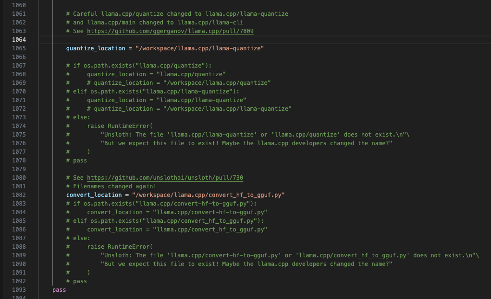

# Fine-tuning Llama-3.2-1B for Healthcare Data

This repository contains the code and resources for fine-tuning the **Llama-3.2-1B** model on health-qa data. The goal of this project is to adapt the Llama-3.2-1B model to better understand and generate responses for health-related queries.

## Overview

The project involves the following steps:

1. **Loading the Model and LoRA Configuration**: Loading the Llama-3.2-1B model and configuring LoRA (Low-Rank Adaptation) for efficient fine-tuning.
2. **Tokenizer Setup**: Preparing the tokenizer for the model.
3. **Dataset Preparation**: Loading and preparing the healthcare dataset.
4. **Fine-tuning**: Fine-tuning the model on the prepared dataset using the `SFTTrainer` from the `trl` library.
5. **Inference**: Testing the fine-tuned model with healthcare-related queries.
6. **Model Saving**: Saving the fine-tuned model and tokenizer to Hugging Face Hub.
7. **Error Handling and Fixes**: Addressing common errors encountered during the process.
8. **Acknowledgments**: Recognizing the contributions of tools and platforms used in the project.

## Dataset & Model

The fine-tuned model and the data can be accessed from my Hugging Face account via the following link:
[HuggingFace Profile](https://huggingface.co/medarsiddhant)

## Installation

To set up the environment and install the necessary libraries, run the following commands:

```bash
!pip install unsloth # Install Unsloth for faster fine-tuning
!pip uninstall unsloth -y && pip install --upgrade --no-cache-dir --no-deps git+https://github.com/unslothai/unsloth.git    # for the latest nightly version
!pip install transformers datasets # Install Hugging Face Transformers and Datasets
!pip install trl # Install TRL (Transformer Reinforcement Learning) for SFTTrainer
!pip install huggingface_hub # Install Hugging Face Hub for model saving
!pip install torch # Install PyTorch (if not already installed)
!pip install bitsandbytes
```

## Usage

Download the dataset from this [link](https://huggingface.co/datasets/medarsiddhant/Health-QA-Finetune-Dataset)

### 1. Load the Model and Setup LoRA

```python
max_seq_length = 2048 # Choose any! We auto support RoPE Scaling internally!
dtype = None # None for auto detection. Float16 for Tesla T4, V100, Bfloat16 for Ampere+
load_in_4bit = True # Use 4bit quantization to reduce memory usage. Can be False.

model, tokenizer = FastLanguageModel.from_pretrained(
    model_name = "unsloth/Llama-3.2-1B-Instruct", # or choose "unsloth/Llama-3.2-1B-Instruct"
    max_seq_length = max_seq_length,
    dtype = dtype,
    load_in_4bit = load_in_4bit,
    token = os.environ.get('HF_TOKEN'), # use one if using gated models like meta-llama/Llama-2-7b-hf
)

model = FastLanguageModel.get_peft_model(
    model,
    r = 16, # Choose any number > 0 ! Suggested 8, 16, 32, 64, 128
    target_modules = ["q_proj", "k_proj", "v_proj", "o_proj",
                      "gate_proj", "up_proj", "down_proj",],
    lora_alpha = 16,
    lora_dropout = 0, # Supports any, but = 0 is optimized
    bias = "none",    # Supports any, but = "none" is optimized
    # [NEW] "unsloth" uses 30% less VRAM, fits 2x larger batch sizes!
    use_gradient_checkpointing = "unsloth", # True or "unsloth" for very long context
    random_state = 313,
    use_rslora = False,  # We support rank stabilized LoRA
    loftq_config = None, # And LoftQ
)
```

### 2. Tokenization

```python
tokenizer = get_chat_template(
    tokenizer,
    chat_template = "llama-3.1",
)

def formatting_prompts_func(examples):
    convos = examples["conversations"]
    texts = [tokenizer.apply_chat_template(convo, tokenize = False, add_generation_prompt = False) for convo in convos]
    return { "text" : texts, }
```

### 3. Prepare the Dataset

```python
dataset = load_dataset("medarsiddhant/Health-QA-Finetune-Dataset", split = "train")

dataset = standardize_sharegpt(dataset)
dataset = dataset.map(formatting_prompts_func, batched = True,)
```

### 4. Fine-tune the Model

```python
trainer = SFTTrainer(
    model = model,
    tokenizer = tokenizer,
    train_dataset = dataset,
    dataset_text_field = "text",
    max_seq_length = max_seq_length,
    data_collator = DataCollatorForSeq2Seq(tokenizer = tokenizer),
    dataset_num_proc = 2,
    packing = False, # Can make training 5x faster for short sequences.
    args = TrainingArguments(
        per_device_train_batch_size = 2,
        gradient_accumulation_steps = 4,
        warmup_steps = 5,
        num_train_epochs = 3, # Set this for 1 full training run.
        # max_steps = 60,
        learning_rate = 2e-4,
        fp16 = not is_bfloat16_supported(),
        bf16 = is_bfloat16_supported(),
        logging_steps = 1,
        optim = "adamw_8bit",
        weight_decay = 0.01,
        lr_scheduler_type = "linear",
        seed = 313,
        output_dir = "outputs",
        report_to = "none", # Use this for WandB etc
    ),
)

trainer = train_on_responses_only(
    trainer,
    instruction_part = "<|start_header_id|>user<|end_header_id|>\n\n",
    response_part = "<|start_header_id|>assistant<|end_header_id|>\n\n",
)

trainer_stats = trainer.train()
```

### 5. Inference

```python
tokenizer = get_chat_template(tokenizer, chat_template="llama-3.1")
FastLanguageModel.for_inference(model)  # Enable native 2x faster inference

messages = [
    {"role": "user", "content": "What causes Low Vision?"},
]
inputs = tokenizer.apply_chat_template(
    messages,
    tokenize=True,
    add_generation_prompt=True,
    return_tensors="pt",
).to("cuda")

text_streamer = TextStreamer(tokenizer, skip_prompt=True)
_ = model.generate(input_ids=inputs, streamer=text_streamer, max_new_tokens=512,
                   use_cache=True, temperature=1.5, min_p=0.1)
```

### 6. Save the Model

```python
finetuned_model_name = "Llama-3-2-1B-Instruct-Healthcare-Finetune"

# Save LoRA adapters and tokenizer
model.push_to_hub(f"medarsiddhant/{finetuned_model_name}-LoRA-Adapter", token=os.environ.get('HF_TOKEN'))
tokenizer.push_to_hub(f"medarsiddhant/{finetuned_model_name}-Tokenizer", token=os.environ.get('HF_TOKEN'))

# Save to GGUF format
model.push_to_hub_gguf(
    f"medarsiddhant/{finetuned_model_name}",
    tokenizer,
    quantization_method=["q4_k_m", "q8_0", "q5_k_m", "f16"],
    token=os.environ.get('HF_TOKEN'),
)
```

### Errors & Fixes

I encountered the following error while pushing the model to HuggingFace:

```
RuntimeError: Unsloth: The file 'llama.cpp/llama-quantize' or 'llama.cpp/quantize' does not exist.
But we expect this file to exist! Maybe the llama.cpp developers changed the name?
```

#### Fix

First, clone the llama.cpp repository and follow the steps below:

```bash
git clone https://github.com/ggerganov/llama.cpp.git
cd llama.cpp
git checkout b3345
git submodule update --init --recursive
make clean
make all -j
git log -1
```

Credits to [Zhangy-ly](https://github.com/Zhangy-ly) for this fix.

If it still does not work, then hardcode the llama.cpp folder path which we cloned earlier in the `save.py` file found at `/usr/local/lib/python3.10/dist-packages/unsloth`.



In my case, I had to hardcode the path.

Note: Here `workspace` is the project folder where the Jupyter notebook exists.

Rerun the following code and it should work now:

```python
# Save to GGUF format
model.push_to_hub_gguf(
    f"medarsiddhant/{finetuned_model_name}",
    tokenizer,
    quantization_method=["q4_k_m", "q8_0", "q5_k_m", "f16"],
    token=os.environ.get('HF_TOKEN'),
)
```

## Acknowledgments

- [Unsloth](https://github.com/unslothai/unsloth) for providing the tools to make fine-tuning faster.
- [Hugging Face](https://huggingface.co/) for the model and dataset hosting.
